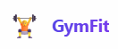
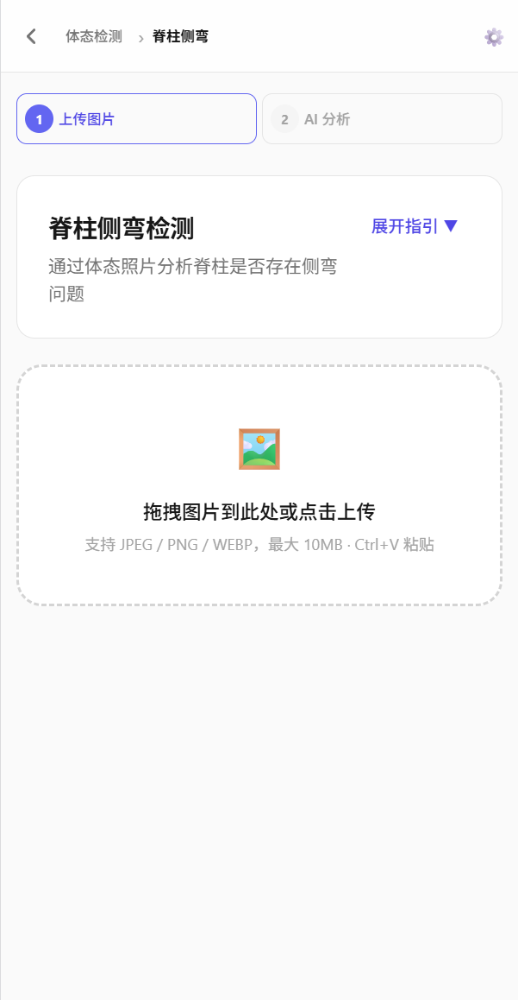
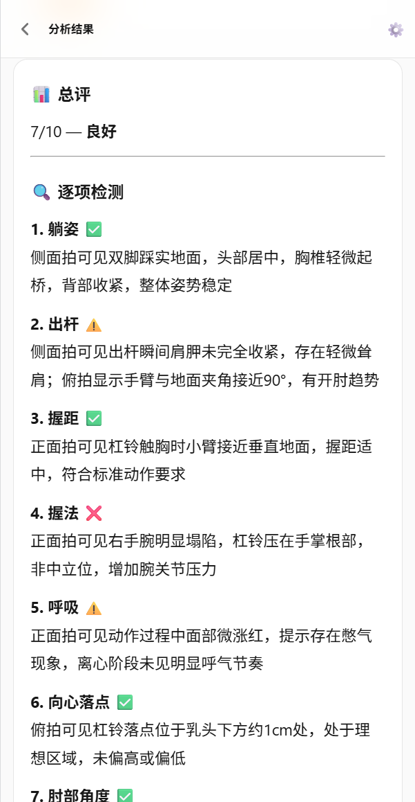
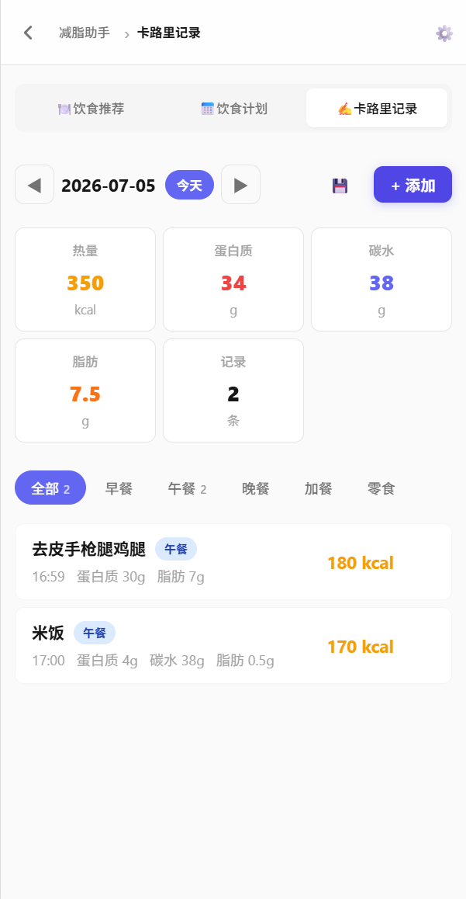

<p align="center">
  
</p>

<h1 align="center">GymFit AI</h1>

<p align="center">
  AI 驱动的智能健身助手 — 拍照上传，秒得专业分析
</p>

<p align="center">
  
  
  
  
</p>

---

## ✨ 功能

<table>
<tr>
<td width="33%">
<h3 align="center">🧍 体态检测</h3>
<p align="center"></p>
<p>上传体态照片，AI 分析脊柱侧弯等潜在问题，给出矫正建议</p>
</td>
<td width="33%">
<h3 align="center">🏋️ 动作检测</h3>
<p align="center"></p>
<p>上传训练视频，多角度逐项检测动作规范性，对比标准参照</p>
</td>
<td width="33%">
<h3 align="center">🥗 减脂助手</h3>
<p align="center"></p>
<p>AI 饮食推荐、碳循环/生酮计划、AI 估算热量的卡路里记录</p>
</td>
</tr>
</table>

---

## 🚀 快速开始

### 1. 配置

```bash
git clone https://github.com/weitaba/GymFit.git
cd GymFit/backend
cp .env.example .env
# 编辑 .env，填入 API Key（支持 Claude / OpenAI / 阿里云百炼）
```

### 2. Docker 一键启动

```bash
docker compose up -d --build
```

访问 `http://localhost:5173`

### 3. 或手动启动

```bash
# 终端1 - 后端
cd backend
python3 -m venv venv && source venv/bin/activate
pip install -r requirements.txt
uvicorn main:app --reload --port 8000

# 终端2 - 前端
cd frontend
npm install && npm run dev
```

---

## 🏗️ 架构

```
用户上传视频/图片
  → 视频抽帧（OpenCV 帧差法检测动作周期）
  → 与标准参照逐帧对比
  → AI 视觉模型分析（Claude / OpenAI / 百炼）
  → 结构化报告返回
```

### 技术栈

| 层 | 选型 |
|---|---|
| 后端 | FastAPI + OpenCV + PyYAML |
| 前端 | React 19 + TypeScript + Vite |
| AI | 可插拔 Provider（Claude Vision / GPT-4V / 通义千问 VL） |
| 存储 | 无数据库 — 内存缓存 + 前端 localStorage |
| 部署 | Docker + Nginx |

---

## 📁 项目结构

```
├── backend/
│   ├── config/detection_types/  ← YAML 检测配置（新增动作只需加文件）
│   ├── providers/               ← AI 接口（Claude/OpenAI/百炼）
│   ├── video_strategies/        ← 视频抽帧策略（每种动作独立策略）
│   ├── routers/                 ← API 路由
│   └── services/                ← 业务逻辑
├── frontend/
│   └── src/pages/               ← 页面组件
├── reference/                   ← 标准动作参照图片
├── docker-compose.yml
└── docs/images/                 ← 截图
```

<!-- --- -->

<!-- ## 📸 需要添加的截图

在 `docs/images/` 目录下放置以下图片，然后替换 README 中的占位标记：

| 文件 | 内容 | 建议尺寸 |
|------|------|----------|
| `logo.png` | 应用图标/Logo | 240×240 |
| `posture.png` | 体态检测流程 | 1200×800 |
| `bench_press.png` | 卧推动作分析结果 | 1200×800 |
| `diet.png` | 饮食推荐或卡路里记录 | 1200×800 |

> **截图技巧**：用浏览器开发者工具设为手机模式（375×812），截图更紧凑好看。GIF 用 [ScreenToGif](https://www.screentogif.com/)（Windows）或 [Kap](https://getkap.co/)（Mac）录制。 -->
<!-- --- -->


## 🤝 贡献

欢迎提交 Issue 和 PR。新增动作检测只需：
1. 在 `backend/config/detection_types/movement/` 下新建 YAML
2. 在 `reference/` 下放标准参照图片
3. （可选）在 `video_strategies/` 下实现自定义抽帧策略
